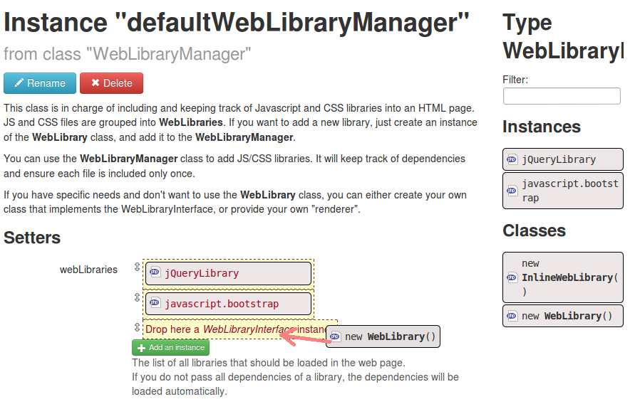
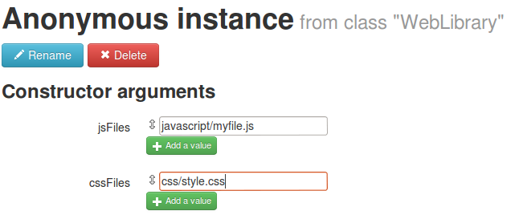

Adding JS and CSS files
=======================

There are several techniques available, depending on your need.
If you want to add JS / CSS files on every page, you will be using dependency injection to inject JS/CSS files directly in the template.
If you want to add JS / CSS files only on some pages, you will be using the code approach.

In every case, JS/CSS addition is managed by the [WebLibraryManager](http://mouf-php.com/packages/mouf/html.utils.weblibrarymanager/README.md).

The _WebLibraryManager_ is a class that references all the JS libraries and CSS files that are included in a web page.
JS files and CSS files are grouped together in _WebLibary_ objects.

On every page
-------------

The _WebLibraryManager_ comes with a default instance *defaultWebLibraryManager*, that is used by the template.



You just need to add a new *WebLibrary* to the instance list.

Then, edit this weblibrary, and add the JS and CSS files you want to include.



<div class="alert">_Note:_ Do not start the JS or CSS file path with a /. That way, the path is relative to the
ROOT_URL (the root of your web application). You can also enter a full path (http://...) if you want to
use hosted libraries, CDN, etc...</div>

On a single page
----------------

Sometimes, you only need to import JS or CSS files in one page. In this case, you will perform the addition
using PHP code. This code will typically go into your controller.

```php
\Mouf::getDefaultWebLibraryManager()->addLibrary(
	new WebLibrary(array("javascript/file1.js", "javascript/file2.js"),
			array("css/style1.css", "css/style2.css"))	
);
```

This codes create a new *WebLibrary* and adds it to the *WebLibraryManager*.
The *WebLibrary* takes an array of Javascript files as first argument, and an array
of CSS files as second argument.

Importing CSS / JS packages using Packagist
-------------------------------------------

A number of packages on Packagist directly support the WebLibraryManager.
In addition, if you are looking for Javascript packages into Composer, you certainly found some packages that are
respecting the "component" bundling format. [This is a format developped by Rob Loach](http://github.com/robloach/component-installer) and that
enables packaging Javascript and CSS files in Packagist easily.

For instance, have a look at the **component/jquery** package on Packagist.

The **WebLibraryManager** has a built in support for these components. If you import one of those Composer packages
in your project, the **WebLibraryManager** will detect these packages and will automatically create the **WebLibrary** instances
matching those packages.

Note: if you import these packages _before_ installing the WebLibraryManager, Mouf will detect the missing instances on the
status page and will offer a button to create those missing instances automatically. 
