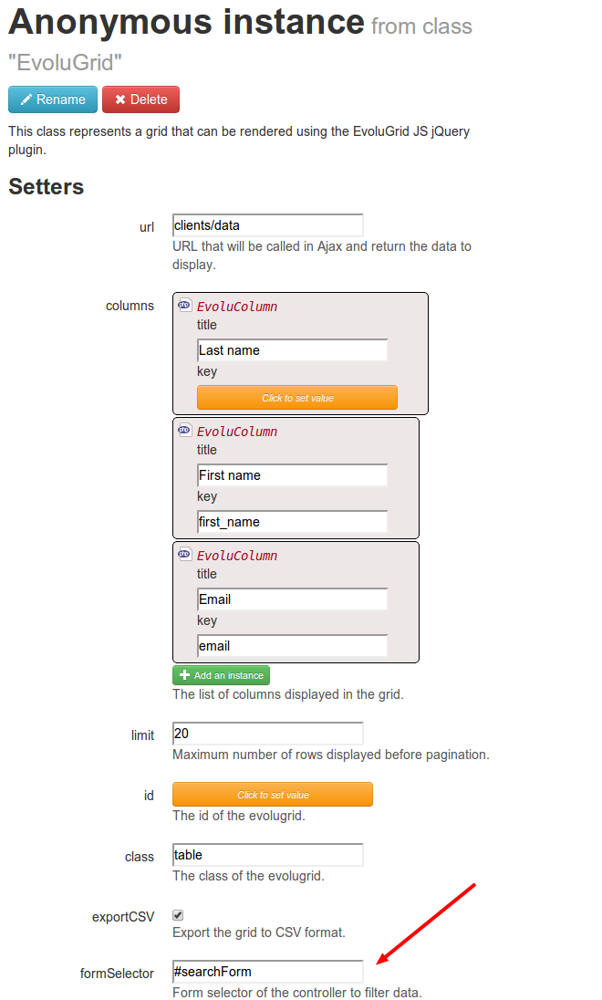

Adding a search form
====================

Somtimes, the grid we display can be very long. Having a pagination system can be not that optimal on long grids.
What we really need is a filter system.

Evolugrid does not come with a filter system of its own, but can very easily be tied to any HTML form.

Let's adapt our [tutorial sample](writing_a_datagrid.md) by adding a filter form on the name or first name.

First we will edit the view to add the search form:

### View: clients_list.php
```php
<?php /* @var $this Test\Controllers\ClientsController */ ?> 

<h1>Clients list</h1>

<form id="searchForm">
	<div>
    <label>Search by name</label>
    <input type="text" name="name" />
    </div>
    <div>
    <button type="submit" class="btn">Search</button>
    </div>
</form>

<?php
$this->clientsGrid->toHtml();
?>
```

As you can see, we just add a simple HTML form with nothing special.

Now, we will go in our EvoluGrid instance and edit the "formSelector" property:



This property takes a CSS selector in parameter. We just put "#searchForm" in the property to bind
the evolugrid to our search form.

Now, refresh your page and click the "Search" button. You will see that instead of submitting the form,
the evolugrid is refreshed.

But we are not over yet, we must now edit our controller and DAO to perform the search.
When we click the "Search" button, an Ajax request is performed to fetch data. All the fields in the form
are passed in parameter. In our search form, there is a "name" field. Therefore, we need to handle
that "name" field in our controller:

### Controller: ClientsController.php
```php
class ClientsController extends Controller
{
	...

	/**
	 * Returns the data for clients
	 *
	 * @Get
	 * @URL clients/data
	 */
	public function data($name = null, $output = "json", $limit = null, $offset = null) {
		$clientBeans = $this->daoFactory->getClientDao()->getClients($name, $limit, $offset);
	
		// Let's go through the beans
		foreach ($clientBeans as $clientBean) {
			/* @var $clientBean ClientBean */
			
			// Let's generate a simple array representing one row
			$row = array(
				'id' =>	$clientBean->getId(),
				'name' =>	$clientBean->getName(),
				'first_name' =>	$clientBean->getFirstName(),
				'email' =>	$clientBean->getEmail(),
			);
			
			$this->clientsGrid->addRow($row);
		}
	
		$this->clientsGrid->output($output);
	}
```

You can compare this method to the one in the [previous tutorial](writing_a_controller.md). You will see 
that the only difference is that we pass a "name" parameter to the DAO.

Let's change the DAO too:

###ClientDao.php
```php
	/**
	 * Returns a list of client beans.
	 * 
	 * @param string name
	 * @param int $limit
	 * @param int $offset
	 */
	public function getClients($name, $limit, $offset) {
		return $this->getClientListByFilter(
				new OrFilter(array(
						new LikeFilter("clients", "name", "%".$name."%"),
						new LikeFilter("clients", "first_name", "%".$name."%"),
				))
				, null, $offset, $limit);
	}
```

We add a "Like" filter on both "name" and "first_name" column.


Testing
-------

That's it! We should now be able to test our filter system.

<div class="alert">Since we modified an action signature in the controller, we need to purge your cache (the red "Purge Cache" button in Mouf) in order to refresh the Splash URL's cache</div>


[You can refer to the complete evolugrid doc here](http://mouf-php.com/packages/mouf/html.widgets.evolugrid/doc/search_filters.md)
