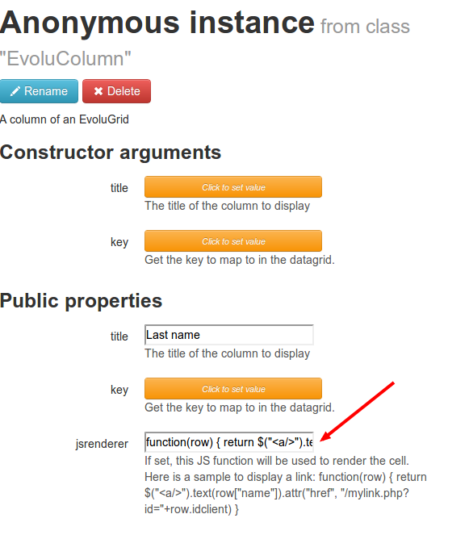

Customising columns in Evolugrid
================================

In the [Writing a datagrid tutorial](writing_a_datagrid.md), we saw how to display an Ajax datagrid
using Mouf and Evolugrid.

In this first tutorial, each column of the table was mapping a single value in the dataset.
However, there are many cases where you might want one cell of your table to map many values of the dataset.

For instance, you might want to display a link (therefore, there are 2 values in one cell: the URL and the text of the link)
Or you might want to display an image, or put special columns with different colors, etc...

Evolugrid has a single mechanism for all those use cases: a Javascript renderer for columns.

When you want to create a special column, you just edit the "EvoluColumn" instance, and instead of filling the "key" property,
you fill the "jsrenderer" property.

Here is a sample based on the previous tutorial: we will make the "Name" column a link to an edition page.
We go back to our Evolugrid instance and we click on the first column to go in the EvoluColumn edition page.



Pay a special attention to the "jsrenderer" instance:

```js
function(row) { return $("<a/>").text(row["name"]).attr("href", "client/edit?id="+row.id) }
```

As you can see, this field contains a Javascript anonymous function.
This function takes one argument: the complete row.
This function returns a jQuery element that will be inserted in the cell of the table.

In the sample above, we create a link, put the "name" value as the text and we use the "id" value of the row to build the link.

We could as well modify the class or the style of the cell, etc...
