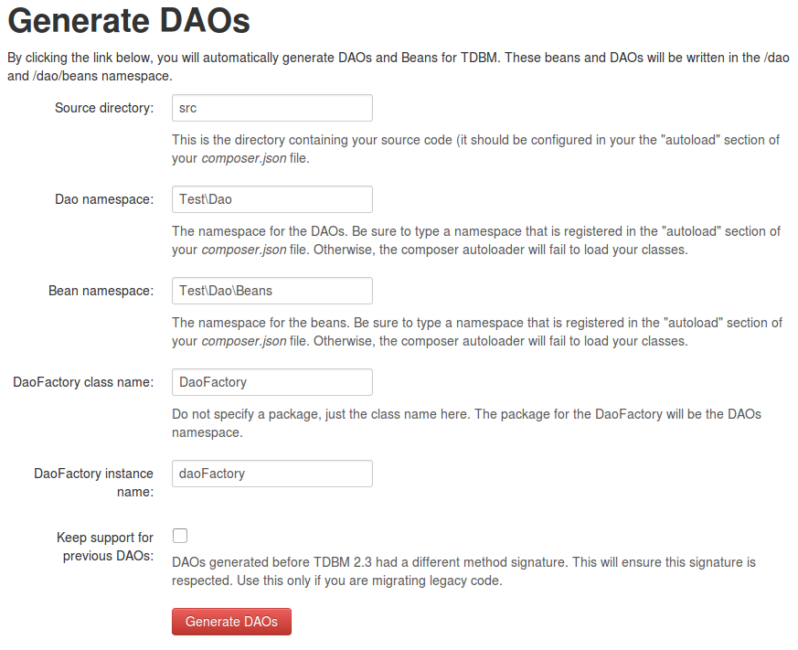

Regenerating DAOs
=================

The _basic edition_ of *Getting things done* comes with [TDBM](http://mouf-php.com/packages/mouf/database.tdbm/) (The DataBase Machine).
When you [installed your project](http://mouf-php.com/packages/mouf/getting-things-done-basic-edition/index.md), TDBM 
generated the DAOs and beans for your database model.

DAOs "Data Access Objects". There is one DAO per table in your database model and each DAO let's you access the rows
of the database. Each row is stored in a "bean".

For instance, if you have a *users* table, TDBM will generate a _UserDao_ class to access the database, and 
results from the database will be stored in _UserBean_ objects.

Each time you modify your database model, you will need to regenerate the DAOs and Beans.

To do this:

Connect to the Mouf user interface (http://[your-server]/[your-app]/vendor/mouf/mouf/)
Click on the _DB > DAOs > Generate DAOs_ menu.

You usually do not need to modify the parameters. Just click the _Generate DAOs_ button, and you are done!