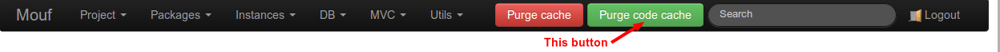
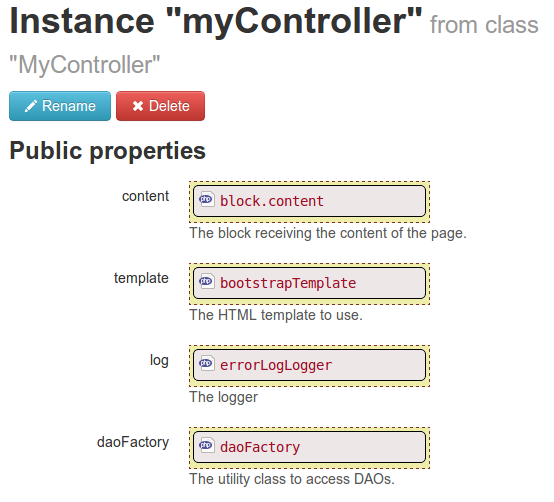
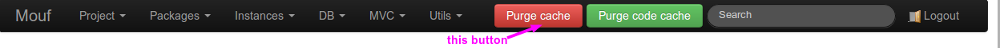

Writing a new controller
========================

This is a quickstart guide to creating a new controller using the "Getting things done" package of Mouf.
For a more complete documentation, read the [Writing controllers](http://mouf-php.com/packages/mouf/mvc.splash/doc/writing_controllers.md)
documentation page from the [Splash MVC framework](http://mouf-php.com/packages/mouf/mvc.splash/index.md).

Writing controllers is a 5 step processes summarized below:

- Create your controller class
- Create one or many views
- Purge the code cache
- Create the controller instance
- Purge the URL's cache

<div class="alert alert-info"><i class="icon-search"></i> The process is almost exactly the same for 
<a href="http://mouf-php.com/packages/mouf/integration.drupal.druplash/">Druplash, the Drupal based MVC framework</a></div>

Create the controller class
---------------------------

Below is a sample class you can use as a model.
It includes what you will most likely need:

- a template
- a logger
- an access to the TDBM factory (to access database)

The code below goes into the _src/Test/Controllers/MyController.php_ file.
It is important to respect that naming convention, as it is used by the class autoloader.
If it seems strange to you, have a look at the [PSR-0](https://github.com/php-fig/fig-standards/blob/master/accepted/PSR-0.md), 
and at the [Composer autoload documentation](http://getcomposer.org/doc/04-schema.md#autoload).

```php
<?php  
namespace Test\Controllers;

use Test\Dao\DaoFactory;
use Mouf\Utils\Log\LogInterface;
use Mouf\Html\HtmlElement\HtmlBlock;
use Mouf\Html\Template\TemplateInterface;
use Mouf\Mvc\Splash\Annotations\URL;
use Mouf\Mvc\Splash\HtmlResponse;

class MyController {

    /**
     * The block receiving the content of the page.
     * 
     * @var HtmlBlock
     */
    public $content;

    /**
     * The HTML template to use.
     * 
     * @var TemplateInterface
     */
    public $template;
    
    /**
     * The logger
     * 
     * @var LogInterface
     */
    public $log;
    
    /**
     * The utility class to access DAOs.
     * 
     * @var DaoFactory
     */
    public $daoFactory;

    protected $echo;

    /**
     * This method will be called when we access the /helloworld URL.*
     * It accepts an optional "echo" parameter.
     * 
     * @URL("/helloworld")
     */
    public function helloworld($echo = '') {
    	// We store the $echo parameter in the controller.
    	// We will access it from the view
        $this->echo = $echo;
        
        // Typical code to access database goes here.
        
        // We declare the view, and bind it to the "content" block.
        // The $this parameter means that in the view file, $this will refer to the controller.
        $this->content->addFile(__DIR__."/../../views/helloworld.php", $this);
        
        // Finally, we draw the template.
        return new HtmlResponse($this->template);
    }

    /**
     * Just echoing some text will output the text directly.
     * This is useful for Ajax calls.
     * 
     * @URL("/helloworld_ajax")
     */
    public function helloworld2() {
        return new JsonResponse(array('hello'=>'world'));
    }
}
```

<div class="alert"><strong>Heads up!</strong> Your code might be slightly different. In particular, you probably
don't use the "Test" namespace. Therefore, the <strong>use</strong> statements at the beginning of the file
might be different.</div>

Note: there is absolutely no need to put your class in a "Controllers" namespace. You can put your class in whatever
namespace you want, as long as Composer is aware of the top level namespace (aka the vendor-name).

Create a view
-------------

In this sample, we are loading a view named "helloworld.php". Let's write this file:

```php
<?php /* @var $this Test\Controllers\MyController */ ?>
<h1>Hello world!</h1>
<p>echo: <?php echo $this->echo ?></p>
```

As you can see, _$this_ in the view refers directly to the controller. We can access any members and any
methods of the controller as long as they are *public* or *protected*. We cannot access *private* members
from the view.

Purge code cache
----------------
Enough coding! We now have some configuration to do.
The first step is to connect to Mouf UI, and purge the code cache.
You should know the URL to Mouf now: http://[your-server]/[your-app]/vendor/mouf/mouf/

When you are logged, click the "Purge code cache" button.



We need to purge the code cache to be sure Mouf will rescan the filesystem and find our new class.

Declare the new instance
------------------------
Click the "Instances > Create instance" menu.

Now, you need to select the "MyController" class, and give a name to your instance.
By convention, we name the instance as the class, except put the name in *camelCase*.
This is because an instance is quite similar to a variable name.


<div class="alert"><strong>A problem?</strong> For a number of reasons, you might not find your controller
in the list of classes. If you have this problem. First: <em>purge the code cache/em>, and try again. If your
class is still not available in the list, go to the <em>Project > Analyze classes</em> menu, and check that
your class has no errors. If you still cannot find your class in the <em>Analyze classes/em> menu, check that
your class respects the PSR-0, that your namespace is correctly configured, and that <em>composer.json/em> is
correctly referencing your top namespace. Also, run "php composer.phar dumpautoload" to make sure your autoload
settings are correctly accounted for by Composer.</div>

Once created, we need to bind the properties of the controller instance. By drag'n'dropping the template, the dao factory
and the logger, you should arrive to this:



Purge the URL's cache
---------------------
Last but not least, you need to purge the URL's cache.
Splash MVC comes with a cache binding each URL to a controller and an action. _Each time you modify a controller
or an action parameter, you need to purge that cache_.

The easiest way to do is to click the big red "Purge cache button":



And you are done!

You can now access your controller, by trying the URL: http://[server-name]/[app-name]/helloworld?echo=42

